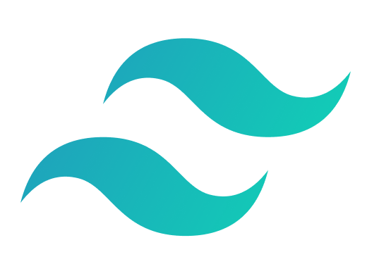

 

 ## 👨🏼‍💻 Technologies I am proficient in
 
 

 
 

 ## 📈 Current Status

 ## 📩 Reach me by

[
](https://www.linkedin.com/in/enamahmedshahaz/)  [
](https://twitter.com/enamahmedshahaz)
 

 ## 👀 Overview

#### 🔭 I’m working on - Frontend technologies: HTML, CSS, Tailwind , React
#### 🌱 I’m currently learning - Next.js
#### 🤔 I’m looking for - A Remote Job
#### ⚡ Fun fact - Trying to be a full stack Java developer

